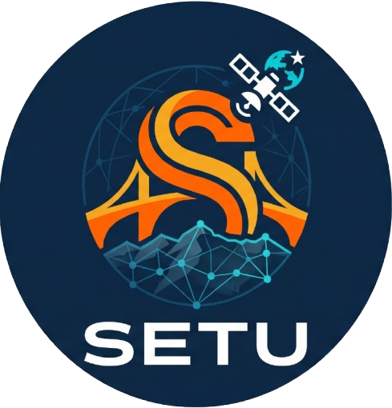

<div align="center">
  

  # 🛰️ Project S.E.T.U (Spatial Extraction and Topological Utility)
  **Bharatiya Antariksh Hackathon 2026** | **Problem Statement 4 - Route Resilience: Occlusion-Robust Road Extraction & Graph-Theoretic Criticality Analysis for Urban Mobility**

  > *"Just as a Setu connects two separated lands, our engine mathematically bridges the gaps in occluded satellite imagery to create a unified, navigable network."*

  ### 🔴 [Live Dashboard: S.E.T.U Engine](https://project-s-e-t-u.vercel.app/)
</div>

---

## 📖 Overview
Standard GIS software and traditional CNNs suffer from "spectral blindness." When a satellite feed is obscured by cloud cover, building shadows, or dense tree canopies, extracted road networks fragment and break, rendering routing algorithms useless.

**Project S.E.T.U** is an autonomous, occlusion-robust geospatial pipeline. It utilizes a custom Hybrid TransUNet deep learning architecture to "hallucinate" logical road continuity beneath occlusions, paired with a graph-theoretic healing engine to mathematically bridge topological gaps. The result is a fully navigable, enterprise-grade vector network ready for disaster response simulation.

---

## 📸 S.E.T.U. in Action (Live Telemetry)

Our Universal Model has been trained on a diverse multi-city dataset to ensure robust extraction across varying topographies, from dense urban grids to complex coastal environments.

### 1. Dense Urban Extraction (Mumbai)
Showcasing the model's ability to map nearly 8,000 infrastructure nodes across highly complex, intertwined urban environments without dropping the framerate.


### 2. ISRO Phase IV: AI Binary Extraction Mask (Mumbai)
The raw TransUNet vision output. By utilizing multi-head self-attention, S.E.T.U pierces through shadows and urban clutter to generate a pure topological skeleton.


### 3. Stable Network Topology (Kalkaji, Delhi)
High-confidence path extraction and Betweenness Centrality mapping in dense residential sectors, clearly distinguishing major arteries (Yellow/Orange) from peripheral links (Blue).


### 4. Disaster Simulation & Cascading Impact (Dwarka, Delhi)
Live ablation testing in action. A critical route has been severed, triggering an instant traffic reroute and revealing a severe 30.0% drop in the overall Network Resilience Index.


### 5. Systemic Vulnerability Mapping (Hyderabad)
Demonstrating the "Degraded Mode" where the AI surgically recalculates the graph matrix, showing how surrounding secondary routes bear the stress of a collapsed major artery.


---

## ✨ Core Features
* **Autonomous Target Acquisition:** Direct integration with geocoding registries to autonomously pull orbital tiles (fully compatible with ISRO Bhuvan / Cartosat feeds).
* **Occlusion-Robust Extraction:** Multi-head self-attention mechanisms maintain road trajectories through extreme urban and terrain clutter.
* **Topological Healing:** NetworkX Minimum Spanning Tree (MST) algorithms connect disjointed edges based on Euclidean and Angular weights.
* **Disaster Simulation (Interactive Ablation):** Click-to-disable functionality that instantly simulates cascading infrastructure failure (e.g., bridge collapse) and recalculates the "Resilience Index" and emergency response time penalties.

---

## 🏗️ System Architecture & Data Flow

S.E.T.U operates on a decoupled microservice architecture for maximum scalability and zero-downtime inference.

### The "Database" & Connection Routing
Instead of a traditional SQL database, S.E.T.U uses **Live Geographic Registries & In-Memory Graph States**:
1. **Frontend Request:** The Vercel-hosted UI queries the OpenStreetMap (OSM) geocoding registry to resolve human-readable locations into bounding box coordinates.
2. **Payload Transmission:** The UI sends an HTTP POST request containing the bounds to the Hugging Face Docker container.
3. **In-Memory Processing:** The backend autonomously fetches the satellite imagery, runs it through the PyTorch TransUNet, and loads the binary mask into a `NetworkX` Graph structure.
4. **Graph Ablation (Stateless):** When a user simulates a disaster, the specific node coordinates are sent back to the API. The engine temporarily severs those specific edges in the graph matrix, recalculates Betweenness Centrality, and returns the updated `GeoJSON` topology back to the client.

---

## 💻 Technology Stack

**AI & Mathematics Engine (Backend):**
* **Deep Learning:** `PyTorch`, `Torchvision`, Hybrid TransUNet
* **Extreme Terrain Augmentation:** `Albumentations`
* **Graph Theory & Topology:** `NetworkX`, `Scikit-Image`, `SciPy`
* **API Middleware:** `FastAPI`, `Uvicorn`, `Pydantic`
* **Deployment:** Hugging Face Spaces (Dockerized CPU/GPU Container)

**Geospatial Dashboard (Frontend):**
* **Mapping Engine:** `Leaflet.js` (Canvas Accelerated)
* **UI/UX:** HTML5, CSS3, Vanilla JavaScript
* **Deployment:** Vercel Edge Network

---

## 🚀 Local Installation & Development

To run the S.E.T.U engine locally, you will need two terminal windows to mimic the microservice architecture.

### 1. Booting the Backend (AI Engine)
```bash
# Clone the repository
git clone [https://github.com/jatinkhandelwal662-jk/Project-S.E.T.U.git](https://github.com/jatinkhandelwal662-jk/Project-S.E.T.U.git)
cd Project-S.E.T.U/backend

# Install required ML and API libraries
pip install -r requirements.txt

# Start the FastAPI inference server
uvicorn app:app --port 8080
