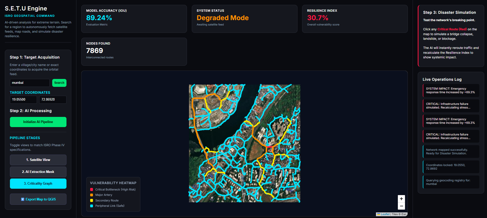
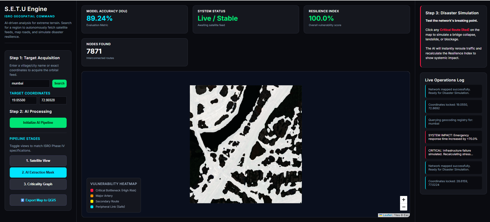
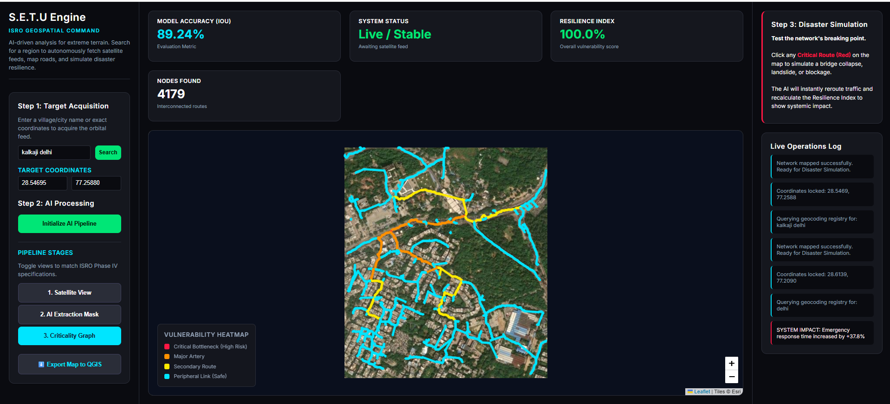
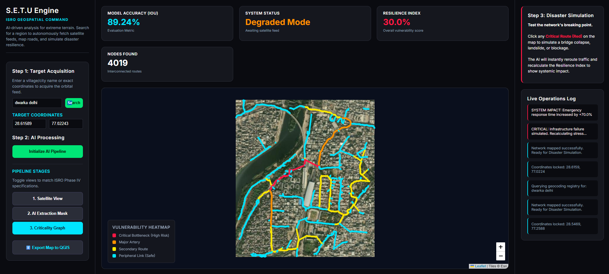
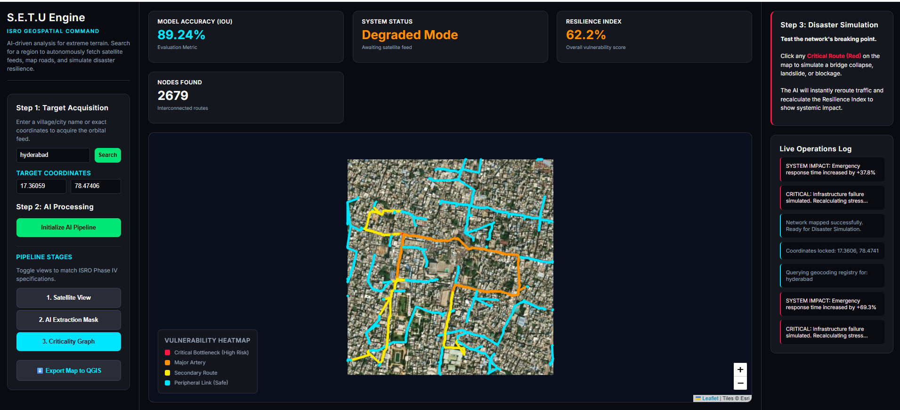

<div align="center">


# 🛰️ Project S.E.T.U

## Spatial Extraction and Topological Utility

### Bharatiya Antariksh Hackathon 2026

### Problem Statement 4

## Route Resilience: Occlusion-Robust Road Extraction & Graph-Theoretic Criticality Analysis for Urban Mobility

[]()
[]()
[]()
[]()
[]()
[]()
[]()

### 🚀 Transforming Fragmented Satellite Imagery into Intelligent, Connected Urban Road Networks

> **"Just as a Setu (Bridge) connects two separated lands, Project S.E.T.U mathematically bridges disconnected road topology hidden beneath occlusions to create a unified, navigable transportation network."**

### 🌍 Live Demo

**https://project-s-e-t-u.vercel.app/**

</div>

---

# 📑 Table of Contents

- Why S.E.T.U?
- Problem Statement
- Why Existing Approaches Fail
- Our Solution
- Key Innovations
- System Pipeline
- Architecture
- Live Demonstration
- Core Features
- Technology Stack
- Mathematical Foundations
- Results

---

# 🌉 Why the Name "S.E.T.U"?

The Sanskrit word **"Setu"** means **Bridge**.

This name represents both the technical objective and the philosophy behind the project.

Traditional satellite road extraction produces fragmented road segments whenever roads disappear beneath:

- Dense Tree Canopies
- Building Shadows
- Cloud Cover
- Vehicles
- Urban Clutter

These disconnected segments cannot be used for routing, navigation, disaster response, or infrastructure planning.

Project **S.E.T.U** mathematically reconstructs these missing links, creating a continuous and navigable road network.

S.E.T.U also expands to

> **Spatial Extraction and Topological Utility**

making the project technically descriptive while preserving a meaningful Indian identity.

---

# 📖 Problem Statement

Modern urban mobility systems rely heavily on accurate digital road networks.

However, traditional satellite-based road extraction systems suffer from **spectral blindness**, where roads disappear beneath shadows, vegetation, clouds, or dense infrastructure.

The resulting road masks become fragmented and topologically disconnected.

These broken networks are unsuitable for:

- Emergency Response
- Smart City Planning
- Disaster Management
- Ambulance Routing
- Logistics Optimization
- Infrastructure Monitoring

Instead of simply extracting roads, modern geospatial intelligence requires complete, connected, and analyzable transportation networks.

---

# ❌ Why Existing Approaches Fail

| Traditional Road Extraction | Project S.E.T.U |
|-----------------------------|-----------------|
| Pixel-level segmentation only | Complete end-to-end geospatial intelligence |
| Roads disappear beneath occlusions | Context-aware road continuity reconstruction |
| Fragmented road masks | Connected transportation graph |
| No topology awareness | Graph-theoretic healing |
| Cannot perform routing | Fully navigable road network |
| Static visualization | Interactive resilience dashboard |
| No disaster simulation | Real-time infrastructure stress testing |
| Limited planning support | Decision support system for planners |

---

# 🚀 Our Solution

Project **S.E.T.U** is an end-to-end geospatial intelligence framework designed to reconstruct urban transportation networks from partially occluded satellite imagery.

Rather than stopping after semantic segmentation, the system continues through topology reconstruction, graph generation, vulnerability analysis, and disaster simulation.

The pipeline integrates multiple domains including:

- Deep Learning
- Remote Sensing
- Graph Theory
- Network Science
- GIS
- Disaster Analytics
- Interactive Visualization

The final output is not merely a road mask but a mathematically connected transportation network capable of supporting real-world decision making.

---

# 💡 Key Innovations

### 🧠 Context-Aware Road Reconstruction

Hybrid TransUNet architecture uses Transformer attention mechanisms to infer hidden road continuity beneath dense occlusions.

---

### 🌉 Graph-Theoretic Topology Healing

Disconnected road fragments are mathematically reconstructed using

- Minimum Spanning Tree (MST)
- Disjoint Set Union (Union-Find)
- Euclidean Distance
- Angular Continuity Constraints

instead of arbitrary pixel connections.

---

### 📊 Structural Intelligence

The reconstructed network is transformed into a weighted graph where each road intersection becomes a graph node.

Network science algorithms identify:

- Critical Junctions
- Bridge Nodes
- Single Points of Failure
- High-risk Transportation Corridors

---

### 🚨 Disaster Simulation

Users can interactively disable roads or intersections.

The system instantly recalculates:

- Shortest Paths
- Betweenness Centrality
- Network Connectivity
- Travel Time
- Resilience Index

allowing planners to evaluate infrastructure vulnerability before disasters occur.

---

# 🔄 Complete System Pipeline

```
Satellite Image
       │
       ▼
Image Preprocessing
       │
       ▼
Hybrid TransUNet
       │
       ▼
Binary Road Mask
       │
       ▼
Skeletonization
       │
       ▼
Road Centerlines
       │
       ▼
Graph Construction
       │
       ▼
Topology Healing
       │
       ▼
Network Analysis
       │
       ▼
Betweenness Centrality
       │
       ▼
Stress Simulation
       │
       ▼
Interactive Dashboard
```

---

# 🏗️ System Architecture

```
                   User

                    │

                    ▼

         Leaflet.js Frontend (Vercel)

                    │

            HTTP REST API

                    │

                    ▼

        FastAPI Backend (Docker)

                    │

                    ▼

      Hybrid TransUNet Inference Engine

                    │

                    ▼

         Binary Road Segmentation

                    │

                    ▼

      Skeletonization & Graph Builder

                    │

                    ▼

          NetworkX Graph Engine

                    │

                    ▼

      Centrality & Resilience Analysis

                    │

                    ▼

         GeoJSON Response Payload

                    │

                    ▼

      Interactive Visualization
```

---

# 📸 S.E.T.U in Action

## 1️⃣ Dense Urban Extraction (Mumbai)

Demonstrates large-scale extraction across highly complex metropolitan road systems containing thousands of interconnected transportation nodes.



---

## 2️⃣ AI Road Segmentation

Raw prediction generated by the Hybrid TransUNet model.

Transformer attention enables reconstruction of roads hidden beneath severe shadows and vegetation.



---

## 3️⃣ Topological Network Reconstruction

The extracted road mask is converted into a connected graph structure.

Road intersections become graph nodes while road segments become weighted graph edges.



---

## 4️⃣ Disaster Simulation

Interactive node ablation instantly recomputes shortest paths and visualizes cascading infrastructure failures.



---

## 5️⃣ Critical Infrastructure Mapping

Betweenness Centrality identifies transportation bottlenecks and vulnerable urban corridors.



---

# ✨ Core Features

## 🛰️ Autonomous Satellite Processing

- Automated geographic coordinate lookup
- Satellite tile acquisition
- Multi-city inference
- Remote sensing compatible

---

## 🧠 Occlusion-Robust Deep Learning

- Hybrid TransUNet
- Multi-head Self Attention
- Skip Connections
- Multi-scale Feature Fusion

---

## 🌉 Topology Reconstruction

- Skeletonization
- Graph Construction
- MST Healing
- Union-Find Optimization
- Edge Refinement

---

## 📊 Graph Analytics

- Betweenness Centrality
- Connected Components
- Shortest Path Analysis
- Critical Junction Detection

---

## 🚨 Disaster Intelligence

- Interactive Road Failure Simulation
- Dynamic Route Recalculation
- Network Resilience Index
- Infrastructure Stress Testing

---

## 🌍 Interactive Dashboard

- Live GIS Visualization
- GeoJSON Rendering
- Dynamic Heatmaps
- Click-to-disable Infrastructure

---

# 💻 Technology Stack

## AI & Machine Learning

- PyTorch
- Torchvision
- Hybrid TransUNet
- Albumentations
- NumPy
- SciPy

---

## Computer Vision

- OpenCV
- Scikit-Image
- Morphological Skeletonization

---

## Graph Theory

- NetworkX
- Minimum Spanning Tree
- Union-Find
- Betweenness Centrality

---

## Backend

- FastAPI
- Uvicorn
- Pydantic
- Docker
- Hugging Face Spaces

---

## Frontend

- HTML5
- CSS3
- Vanilla JavaScript
- Leaflet.js
- OpenStreetMap

---

## Deployment

- Vercel
- Hugging Face Spaces

---

# 📐 Mathematical Foundations

Project S.E.T.U combines Computer Vision with Graph Theory.

### Graph Representation

```
G = (V, E)
```

Where

- **V** represents road intersections

- **E** represents road segments

---

### Topology Healing

Road discontinuities are repaired using

- Minimum Spanning Tree (MST)

- Euclidean Distance Minimization

- Angular Alignment Constraints

- Disjoint Set Union

---

### Criticality Analysis

Road importance is computed using

**Betweenness Centrality**

Nodes lying on the maximum number of shortest paths become critical transportation bottlenecks.

---

### Network Resilience

The system evaluates

```
Resilience Index

R = Baseline Network Efficiency
    ----------------------------
    Perturbed Network Efficiency
```

A lower value indicates higher vulnerability.

---

# 📁 Project Structure

```text
Project-S.E.T.U
│
├── backend
│   ├── app.py
│   ├── inference.py
│   ├── graph_engine.py
│   ├── topology.py
│   ├── utils.py
│   ├── requirements.txt
│   └── Dockerfile
│
├── frontend
│   ├── index.html
│   ├── script.js
│   ├── style.css
│   ├── favicon.png
│   └── assets
│
├── ml_model
│   ├── train.py
│   ├── dataset.py
│   ├── model.py
│   ├── losses.py
│   ├── checkpoints
│   └── configs
│
├── results
│   ├── result_1.png
│   ├── result_2.png
│   ├── result_3.png
│   ├── result_4.png
│   └── result_5.png
│
├── README.md
├── LICENSE
└── requirements.txt
```

---

# 🚀 Getting Started

## Clone Repository

```bash
git clone https://github.com/jatinkhandelwal662-jk/Project-S.E.T.U.git

cd Project-S.E.T.U
```

---

# ⚙️ Backend Setup

Install dependencies

```bash
cd backend

pip install -r requirements.txt
```

Start FastAPI

```bash
uvicorn app:app --host 0.0.0.0 --port 8080
```

Backend will be available at

```
http://localhost:8080
```

---

# 🌍 Frontend Setup

Open another terminal

```bash
cd frontend

python -m http.server 3000
```

Visit

```
http://localhost:3000
```

---

# 🔁 Workflow

```
User Search

↓

Coordinates

↓

Satellite Tile

↓

Hybrid TransUNet

↓

Road Mask

↓

Skeleton

↓

Road Graph

↓

Topology Healing

↓

Criticality Analysis

↓

GeoJSON

↓

Interactive Dashboard
```

---

# 🛰️ Supported Datasets

The model is designed to work with

- Sentinel-2
- Resourcesat LISS-IV
- Cartosat
- SpaceNet Roads
- DeepGlobe Roads
- OpenStreetMap
- OpenSatMap

The architecture has been designed to generalize across

- Dense Urban Cities
- Semi Urban Areas
- Rural Road Networks
- Coastal Regions
- Forested Regions

---

# 🎯 Use Cases

## 🚑 Disaster Response

Instantly determine which road failures have maximum impact during

- Floods
- Earthquakes
- Landslides
- Bridge Collapse

---

## 🏙 Smart City Planning

Identify transportation bottlenecks before infrastructure expansion.

---

## 🚓 Emergency Routing

Support emergency services with resilient route planning.

---

## 🌉 Infrastructure Monitoring

Detect vulnerable transportation corridors requiring preventive maintenance.

---

## 🛰 National Mapping

Assist government agencies in building robust national transportation datasets.

---

# 📈 Disaster Simulation

One of the key innovations of S.E.T.U is interactive infrastructure stress testing.

Users can click any critical junction to simulate

- Road Closure
- Bridge Collapse
- Flooded Junction
- Construction Blockage

The engine automatically

- Removes affected graph nodes
- Recalculates shortest paths
- Updates Betweenness Centrality
- Computes new Resilience Index
- Displays rerouted transportation flow

This transforms a static satellite map into a decision-support platform.

---

# 🔬 Research Contributions

Project S.E.T.U contributes beyond semantic segmentation by integrating

- Context-aware Deep Learning
- Graph-Theoretic Reconstruction
- Topological Healing
- Critical Infrastructure Analytics
- Disaster Simulation
- Interactive Urban Intelligence

The framework combines computer vision and graph theory into a unified geospatial intelligence pipeline.

---

# ⚡ Innovation Highlights

✅ Hybrid Transformer + CNN Architecture

✅ Occlusion-aware Road Continuity

✅ Graph-based Topology Reconstruction

✅ Mathematical Network Healing

✅ Interactive Disaster Simulation

✅ Network Resilience Index

✅ Real-time Criticality Visualization

✅ Decision Support Dashboard

---

# 📚 Research References

The following resources inspired the development of this project.

## Remote Sensing

- ISRO Cartosat
- ISRO Bhuvan
- Sentinel-2
- Resourcesat LISS-IV

## Datasets

- SpaceNet Roads Dataset
- DeepGlobe Road Extraction Challenge
- OpenStreetMap
- OpenSatMap

## Research

- TransUNet
- U-Net
- DeepLabV3+
- Attention U-Net

## Graph Theory

- NetworkX Documentation
- Minimum Spanning Tree
- Disjoint Set Union
- Betweenness Centrality

---

# 🚀 Future Work

Future enhancements include

- Graph Neural Networks (GNNs)
- Multi-temporal Satellite Analysis
- Flood Prediction Integration
- Real-time Traffic Fusion
- UAV Imagery Support
- Temporal Infrastructure Monitoring
- Automatic Road Damage Detection
- Multi-country Deployment
- ISRO Bhuvan Integration
- Edge Deployment on Satellite Processing Systems

---

## 👥 Team TARS 

Engineered for the Bharatiya Antariksh Hackathon. 
* **[Riya Sharma](https://github.com/riyaa8484)**
* **[Khushi Dalal](https://github.com/khushiidalal)**
* **[Jatin Khandelwal](https://github.com/jatinkhandelwal662-jk)**
* **[Bhavishya Bhati](https://github.com/BHAVISHYA-2007)**

---

<div align="center">

## 🌉 Project S.E.T.U

### Spatial Extraction and Topological Utility

**"From Fragmented Pixels to Intelligent Transportation Networks."**

---

Built with ❤️ for **Bharatiya Antariksh Hackathon 2026**

**Team TARS**

⭐ If you found this project interesting, consider giving the repository a star.

</div>
